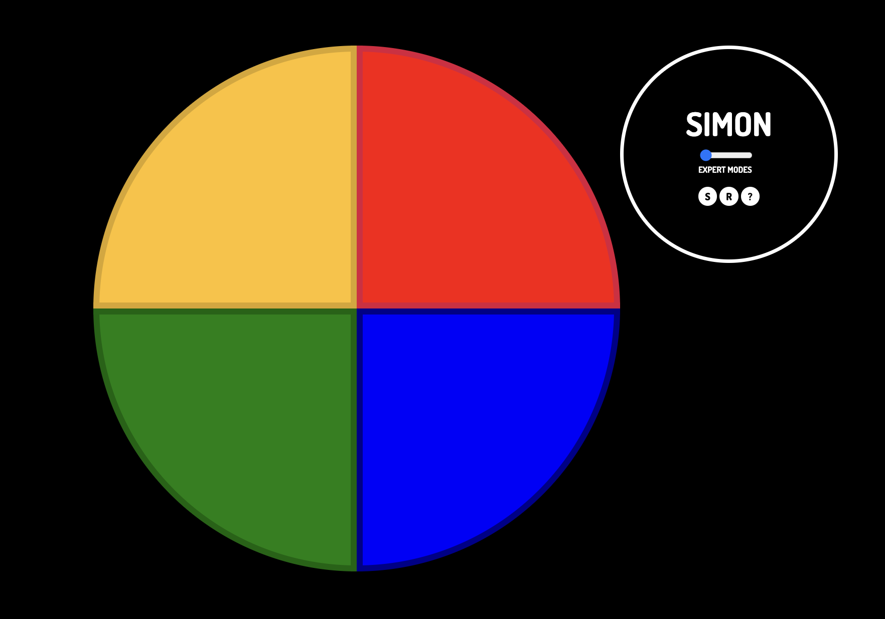
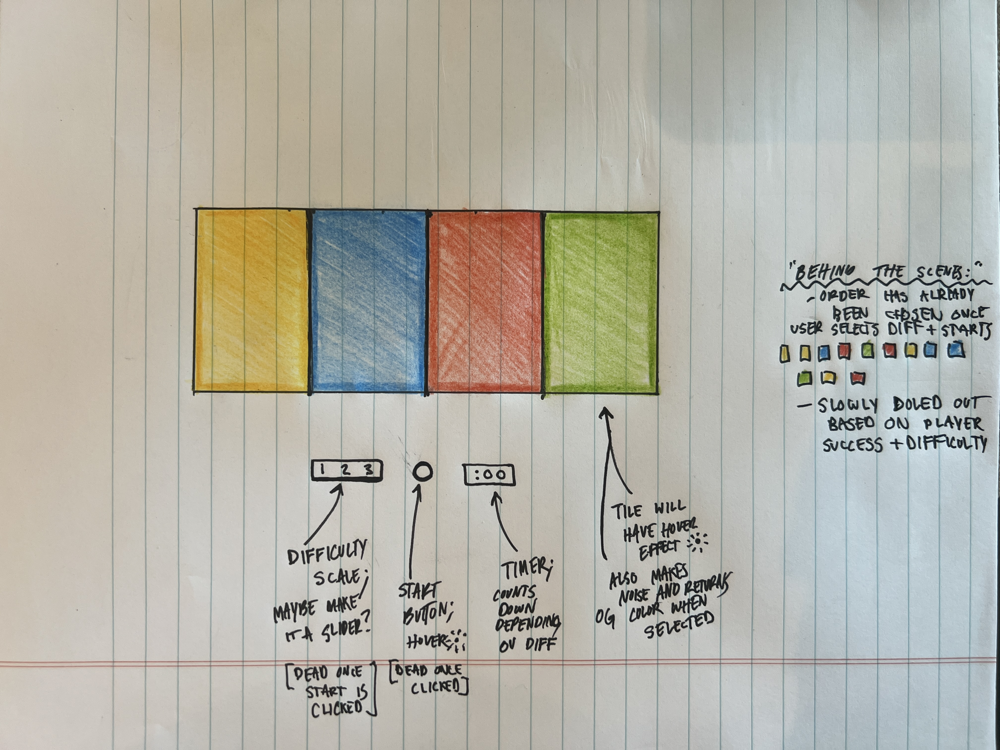

## READ ME

## SIMON 

### LIST OF TECHNOLOGIES USED:

HTML, CSS, Javascript.
Utilized some videos online as well as copious Googling.

### INSTALL INSTRUCTIONS:

1. Fork this repo.
2. Clone this repo.
3. Open with your visual code editor
4. Go Live with the index.HTML file.

OR

Feel free to use this link:
[SIMON GAME](https://jaxdsout.github.io/project-one/)

### HOW TO PLAY:
The game will randomly create a series of sound tones and lights and requires a user to repeat the sequence. 

This process is visualized on four uniquely-colored tiles. The user will repeat the sequence by selecting the appropriate tile in order.

If the user succeeds, the series will become progressively longer and more complex. Once the user fails or the time limit runs out, the game is over.

## USER STORIES

#### AS A USER, I WANT TO...
- be able to select difficulty level
- be able to start the game
- be able to SEE & HEAR which tile the game is activating
- be able to select which tile I want
- be able to SEE & HEAR my responses being recorded (live feedback on buttons)
- have my responses be recorded/cached correctly
- be able to see how much time I have left to return the visual pattern
- want to know whenver I completed the sequence of 13 (fanfare or something amazing)

#### AS A GAME, I WANT TO...
- prevent players from do-overs (NO GO BACKSIES)
- prevent players from seeing the current visual pattern more than once
- be able to auto compare users inputs versus mine (the correct way)
- be purely random regardless of difficulty level so player can never remember sequencing
- don't want to signify when player can begin repeating visual pattern; just start counting the clock
- don't want to inform player they got it right; simply move on to the next tile(s) in the visual pattern

## WIREFRAMES

## MININUM VIABLE PRODUCT
    1. User clicks small circle button to begin game
    2. Game will randomize a sequence of buttons
    3. Game illuminates buttons in order of the sequence
    4. User then selects button(s) in order that game displayed
    5. If user enters correctly, user advances and game increases amount of button sequences.
    6. Game ends when user is able to repeat 13 tiles in the sequence
    7. If user is ever incorrect, game makes error noise and prompts user 'game over'
    8. Game will allow user to reset whenever they want.

    --Game will also look, feel and sound like original handheld device

## STRETCH GOALS
    1. Institue countdown clock for each turn
    2. Have Difficulty 2 & 3 to make game even harder (more buttons to click & tiles get less noticeable)
    3. Instead of timer, maybe have tiles disappear into black (possible level 3 option)

## HURDLES
    1. Biggest hurdle was choosing which way to run gameflow as there were many (setTimeout, setInterval, async, for loops, etc). Ultimately went with setTimeout as it gave me more flexixibility and I understood it. This process is where I got stuck in the development of the game. Required lots of reading and throwing stuff at the wall. See point 2.
    2. A hurdle early on in the process was psuedocoding. It would have been more helpful to find all the gaps in my knowledge first rather than get stuck for hours until something worked.
    3. A styling hurdle was centering the divs on top of one another. To make the layout response, I ultimately changed the design.
   
